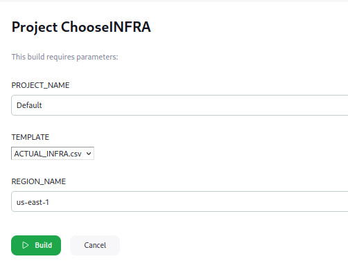
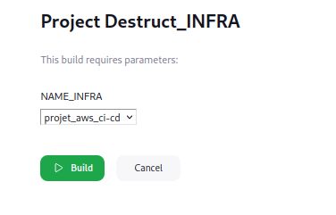
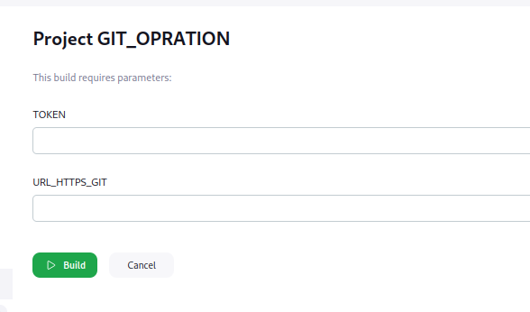
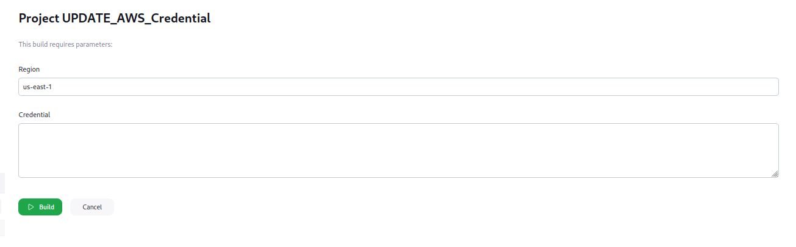

# Jenkins-AWS

---
### Guide d'Utilisation

Les différents fichiers que vous trouvez correspondent chacun à un job dédié dans Jenkins. Le contenu de ces fichiers doit être placé à l'intérieur du job correspondant en utilisant l'option '[Build Step]' avec l'exécution shell.

## Choose infra

### Choix de templates 

Ce job permet de mettre en place une infrastruction selon le template choisit. En sachant que c'est possible d'uitiliser plusieur une template en modifiant le nom de l'infra. 
## Prérequis
Il faut strictement avoir deux repertoire infra et templates pour le bon fonctionnement du job, leur chemin n'est pas important c'est à dire ils peuvent se trouver dans different endroit mais il faut le préciser dans le script.

### Configuration

Il faut mettre en place 3 parametres : deux de types string, un de type active choice paramter.
Dans le parametre active choice parameter, il faut cocher Groovy Script et mettre dans le contenu ce qui se trouve dans le fichier '[ list_of_folder.groovy]'.

---

## Desctruction infrastructure

### Suppression d'infrastructure

### Configuration

Il faut ajouter un seul parametre active choice parameter et il faut cocher Groovy Script et mettre dans le contenu ce qui se trouve dans le fichier '[ list_of_folder.groovy]'.

---

## Git operation

### Mise en place d'une infrastructure simple

### Configuration

Il y a deux paramètres de type chaîne de caractères : l'un pour le token et l'autre pour l'URL.
NB: Il faut generer depuis le github un token et l'url se trouve sur le github.

---

##  Credential 

### Automatisation ACCESS Key 

Il met à jour la région et les identifiants pour accèder à AWS CLI.

### Configuration

Il y a deux paramètres de type string : l'un c'est pour la region et l'autre pour access_key et access_id.

---

ATTENTION!! Toutes les variables dont le nom commence par le symbole $ représentent des noms de paramètres.
